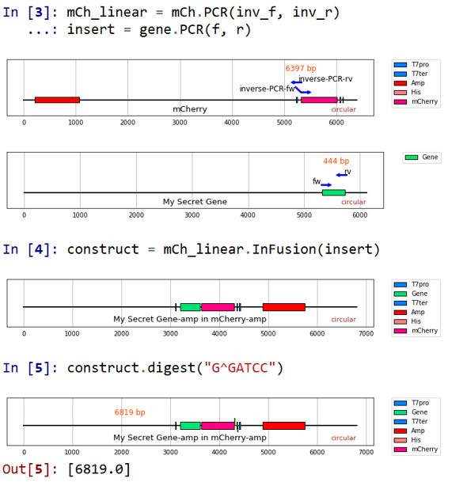

# DNAwork
Check PCR, In-Fusion and restriction enzyme digestion in Python before buying primers.
`biopython` is not needed.



# Basic Usage
Make `DNA` objects and simulate DNA works.
If your primer design was wrong, this code will raise `ExperimentError`.

## Load Sequences
Load DNA sequences from .ape file or raw text.

```python
from DNAwork import DNA
gene = DNA(r"C:\Users\...\gene.ape", name="XXX Gene")
f = DNA("gg...gg", name="fw")
r = DNA("ca...ag", name="rv")
```

DNA features are also contained in `DNA` objects, which can be visualized using `plot`.

```python
gene.plot()
```

## PCR
Simulate PCR, with template `gene` and primers `f` and `r`.

```python
product = gene.PCR(f, r)
```

In more strict condition (>=20 bp match).

```python
product = gene.PCR(f, r, min_match=20)
```

## In-Fusion
Simulate In-Fusion, with vector `vec` and insert `ins`.

```python
out = vec.InFusion(ins)
```

## Translation
```python
gene.translate(startswith="atgaagg")
# MKG...
```

## Restriction Enzyme Digestion
```python
gene.digest("G^GATCC")
```

